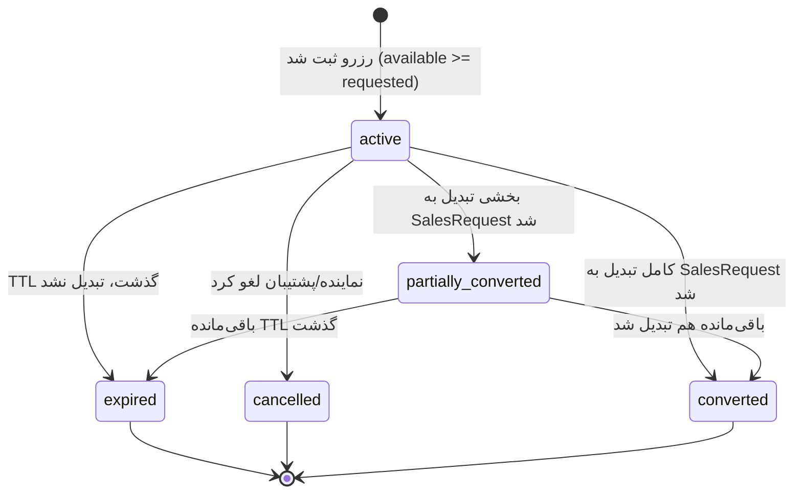
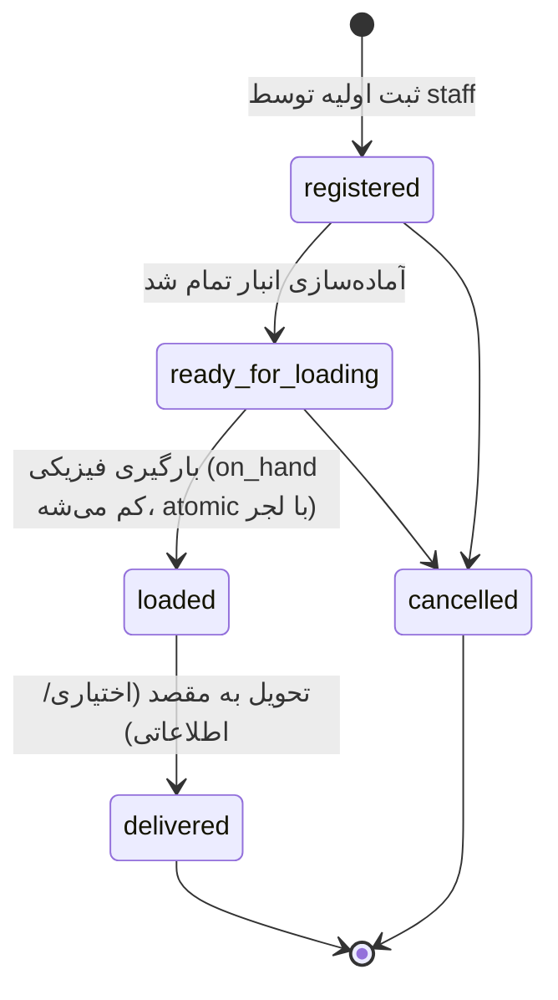

# سند جامع محصول: پنل موجودی و رزرو نمایندگان کاشی و سرامیک

> **نسخه‌ی نهایی (تجمیع v1 تا v7).** این نسخه از ابتدا تا انتها بازخوانی و کامل شد — چند بخش (امنیت، UX، معماری React، ایندکس‌ها، API) در نسخه‌های ۴ تا ۷ به‌خاطر «بدون تغییر» نوشتن، به‌تدریج از سند حذف شده بودن بدون این‌که واقعاً منسوخ شده باشن. این‌جا کامل برگردوندم. منابع مشورت‌شده در طول مسیر: تحلیل‌های من، Qwen 3 Coder، Gemini 3.1 Pro، Claude Fable 5، GapGPT 5.6، GPT-5.3 Codex، و ۶ اسکرین‌شات واقعی از my.talaceram.com.

---

## ۱. تعریف محصول و مرز MVP

> **سیستم مدیریت موجودی، رزرو و درخواست سفارش نمایندگان، مخصوص کارخانه‌های کاشی و سرامیک** — Vertical SaaS چندمستأجری.

زنجیره: مشاهده موجودی → رزرو → SalesRequest → تأیید → SalesDispatch → بارگیری فیزیکی.

**در MVP نیستیم:** حسابداری کامل، فاکتور قانونی، پرداخت آنلاین، لجستیک/حمل کامل (فقط تا لحظه‌ی بارگیری)، اتصال زنده به ERP، اعتبارسنجی مالی واقعی، `Customer` به‌عنوان Entity کامل با تاریخچه.

اسم موجودیت سفارش: `SalesRequest` (نه `Invoice`) — این دو از نظر حقوقی/محصولی یکی نیستن.

---

## ۲. بازار و رقبا

| دسته | نمونه | نقطه‌ضعف برای بازار هدف تو |
|---|---|---|
| حسابداری تخصصی کاشی | سپیدار، هلو، محک، کاکتوس، سندپرداز، پارمیس | داخلی، بدون دسترسی نماینده |
| نرم‌افزار داخلیِ کارخونه‌ی واقعی | my.talaceram.com — طلاسرام کویر (یزد/زارچ، تاسیس ۱۳۸۷، تایید‌شده با سرچ) | پنل ادمین داخلیه (staff)؛ مدرکی نداریم نماینده‌ی بیرونی بهش دسترسی جدا داره |
| ERP سنگین | همکاران سیستم | گران، سنگین برای کارخانه‌ی کوچک |
| عمومی جهانی | NuORDER، Handshake، Unleashed، Bridge | نه فارسی، نه در دسترس ایران |
| جایگزین فعلی بازار هدف | تلفن + اکسل + واتس‌اپ/تلگرام غیررسمی | همون دردی که حلش می‌کنی |

**مزیت رقابتی:** عمق تخصصی صنعت (سورت/شید/کالیبر/بچ/تبدیل واحد) + UX نماینده‌محور + رزرو واقعی با قانون + مزیت جغرافیایی یزد/میبد + تاب‌آوری زیرساخت (میزبانی داخلی + آفلاین فقط‌خواندنی — در قطعی اینترنت بین‌الملل هم در دسترس می‌مونه) + قیمت اشتراکی سبک.

---

## ۳. زیرساخت و میزبانی

### ۳.۱ اول یه تفکیک: میزبانیِ اپلیکیشن ≠ محیط توسعه

این دو تا رو قاطی نکن:
- **محیط توسعه (جایی که کد می‌نویسی و پلتفرم‌های آمریکایی رو استفاده می‌کنی):** اینجا Vercel/Supabase/گیت‌هاب‌اکشنز مشکل‌سازن (تحریم OFAC). این بحث جداست و پایین‌تر.
- **میزبانیِ اپلیکیشن آنلاین (جایی که کاربر نهایی — نماینده — بهش وصل می‌شه):** اینجا سؤال واقعی «ایران یا اروپا» است.

### ۳.۲ ایران یا اروپا؟ — تصمیم برای این پروژه‌ی خاص

بعد از بررسی، برای **این** پروژه پیشنهادم **VPS ایران** است، نه اروپا — و این برخلاف چیزیه که تو نسخه‌های قبلی نوشتم. دلیلش به ماهیت خاص این محصول برمی‌گرده:

**چرا ایران برای این پروژه بهتره [محتمل]:**
- **مهم‌ترین دلیل — تاب‌آوری در قطعی اینترنت بین‌الملل:** ایران سابقه‌ی قطعی سراسری اینترنت بین‌الملل داره (اینترنت ملی). در این حالت، سایت‌های میزبانی‌شده در ایران برای کاربر داخلی **در دسترس می‌مونن**، ولی سایت‌های خارجی قطع می‌شن. برای سیستمی که کسب‌وکار روزانه‌ی نماینده‌ها بهش وابسته می‌شه، این تعیین‌کننده‌ست. یه پنل رزرو که دقیقاً روز قطعی اینترنت از دسترس خارج بشه، بدترین حالت ممکنه.
- **پینگ و سرعت پایین‌تر برای کاربر داخلی:** مخاطب تو ۱۰۰٪ داخل ایرانه (نماینده‌های کارخونه‌های یزد/میبد). فاصله‌ی فیزیکی کمتر = پاسخ سریع‌تر.
- **هزینه‌ی کمتر** و پرداخت ریالی ساده (بدون دردسر پرداخت ارزی برای Hetzner/OVH).
- **بدون ریسک تحریمِ سمت میزبان:** ارائه‌دهنده‌ی ایرانی اکانتت رو به‌خاطر IP/ملیت معلق نمی‌کنه.

**هزینه‌ی این انتخاب (صادقانه):**
- زیرساخت دیتاسنترهای داخلی معمولاً از نظر سخت‌افزار و پایداریِ لحظه‌ای ضعیف‌تر از Hetzner/OVHه.
- سرویس‌های جهانی مثل Cloudflare (CDN/محافظت) داخل ایران خوب کار نمی‌کنن.
- اگه یه روز خواستی مخاطب بین‌المللی هم بگیری، باید مهاجرت کنی — ولی این پروژه ذاتاً داخلیه، پس بعیده.

**جمع‌بندی:** چون این محصول (۱) مخاطب کاملاً داخلی داره و (۲) کسب‌وکار روزانه بهش وابسته می‌شه، تاب‌آوری در قطعی اینترنت از پایداریِ سخت‌افزاریِ کمی بهتر مهم‌تره. پس **ایران**.

> **گزینه‌ی محافظه‌کارانه‌تر (اگه بودجه اجازه داد):** یه معماری دو-میزبانه — اپلیکیشن روی ایران (برای دسترسی‌پذیری)، ولی بک‌آپ رمزنگاری‌شده‌ی دیتابیس هم روی یه مقصد خارجی (برای این‌که اگه دیتاسنتر داخلی مشکل جدی خورد، داده‌ات گم نشه). این بهترین هر دو دنیاست.

### ۳.۳ محیط توسعه (این بحث جداست و تغییر نکرده)

موقع **ساختن** پروژه، هنوز باید مراقب پلتفرم‌های آمریکایی باشی:
- **Vercel/Supabase مدیریت‌شده:** برای دیپلوی نهایی استفاده نکن (چه ایران چه اروپا، خودت روی VPS با Docker/PM2 + Nginx/Caddy بالا بیار). Vercel رسماً کشورهای تحریم‌شده رو بلاک می‌کنه.
- **کد:** mirror روی دو remote (نه فقط گیت‌هاب پرایوت که برای ایران محدوده)؛ GitLab یا self-hosted git.
- خودِ Next.js و Postgres مشکلی ندارن (کد متن‌بازه، فقط دانلود می‌شه) — مشکل فقط لایه‌ی سرویسِ مدیریت‌شده‌ی آمریکایی‌ست.

### ۳.۴ الزامات عملیاتی (فارغ از انتخاب مکان)
- بک‌آپ روزانه‌ی رمزنگاری‌شده **خارج از سرور اصلی** + تست دوره‌ای Restore + snapshot
- عدم expose مستقیم پورت Postgres به اینترنت
- HTTPS با Let's Encrypt (Caddy/Nginx)

---

## ۴. شکاف‌های واقعی از UI یه کارخونه‌ی نمونه

از ۶ اسکرین‌شات my.talaceram.com:

- **مدل محصول واقعی:** نام، کد، پانچ (قالب پرس)، لعاب، رنگ، درجه کیفی (لیست‌باکس یک/دو/سه/چهار)، تصویر. یه محصول با درجه‌های مختلف، **ردیف جداگانه** می‌سازه.
- **موجودی:** کارتن + پالت با هم؛ نسبت نمونه‌ی دیده‌شده ۹۶ کارتن در هر پالت. برند (طلاسرام/خوارزم) فقط تو نمای انبار دیده شد، نه فرم ثبت محصول — منشأش هنوز باز.
- **«حواله فروش»** موجودیت کاملاً جداست: کد، شماره (شبیه ارجاع دفتر کاغذی)، مشتری نهایی (اسم شخص، نه نماینده!)، مقصد، وضعیت (حداقل «ثبت شده» و «آماده بارگیری» دیده شد).
- **دو مسیر افزودن قلم به حواله:** «انتخاب از موجودی» (عادی) و «ثبت محصول ناموجود» (backorder).
- فیلدهای «ستون»/«شماره» در اقلام حواله → احتمالاً موقعیت فیزیکی انبار (رَک/قفسه).
- دکمه‌ی «همگام‌سازی موجودی» → احتمالاً یعنی این سیستم با یه منبع دیگه سینک می‌شه، نه این‌که خودش تنها منبع حقیقته؛ سیستم تو که قراره خودش منبع حقیقت باشه، بهش نیاز نداره (مگر بخوای Import اکسل رو همین اسم بذاری).

> ⚠️ کلمات «شید» و «کالیبر» هیچ‌جای این سیستم واقعی دیده نشد. این می‌تونه یعنی این کارخونه دیجیتالی‌شون نمی‌کنه، **یا** ممکنه داخل `batch_number` کدگذاری شده باشن یا کاملاً بیرون از نرم‌افزار (روی برچسب پالت، حافظه‌ی انباردار) مدیریت بشن — غیبت از UI به‌معنای غیبت از واقعیت فیزیکی نیست. این سؤال مصاحبه‌ست، نه فرض.

---

## ۵. مدل داده کامل

### ۵.۱ هویت، تننت، حساب نمایندگی

```
User: id, phone (UNIQUE), email, password_hash, is_active, created_at
Tenant: id, name, slug (UNIQUE), is_active,
    default_reservation_ttl_hours INT DEFAULT 24,
    track_shade_caliber ENUM(off, optional, required) DEFAULT 'optional'
TenantMembership: id, tenant_id, user_id, role, is_active
AgentAccount: id, tenant_id, legal_name, code, credit_limit, is_active,
    UNIQUE(tenant_id, code)
AgentAccountUser: agent_account_id, user_id, role
```
`User` جدا از `AgentAccount` است چون یه نمایندگی می‌تونه چند کاربر داشته باشه (مدیر خرید + اپراتور سفارش) و اطلاعات مالی (`credit_limit`) ویژگیِ حساب تجاریه، نه هویت شخص. یه فیلد مالی‌ِ کش‌شده مثل «مانده‌ی گزارش‌شده» عمداً حذف شد — چون MVP اعتبار مالی واقعی رو پوشش نمی‌ده، و نگه‌داشتن یه عدد کش‌شده‌ی بدون لجر مالی دقیقاً همون کلاس باگیه که برای موجودی حل کردیم.

> همه‌ی جدول‌های زیر `tenant_id` + FK ترکیبی به والدشون دارن، حتی اگه برای اختصار روی هر خط تکرار نشده باشه.

### ۵.۲ کاتالوگ

```
Brand: id, tenant_id, name
Product: id, tenant_id, code (NOT NULL, UNIQUE per tenant),
    name, color, glaze, punch, image_url
    -- brand_id: فعلاً اینجا (باز، بخش ۷)
ProductVariant: id, tenant_id, product_id, grade,
    sku (NOT NULL, UNIQUE per tenant), boxes_per_pallet
    FOREIGN KEY (tenant_id, product_id) REFERENCES product(tenant_id, id)
InventoryLot: id, tenant_id, variant_id, warehouse_id, batch_number,
    shade_code (nullable), caliber_code (nullable), entry_date,
    bin_location (nullable), boxes_per_pallet_override (nullable)
```
سه‌لایه‌ی `Product → ProductVariant → InventoryLot`: کاتالوگ (چیزی که نماینده مرور می‌کنه) از موجودی فیزیکی (بچ واقعی در انبار) جداست. `grade`، `shade_code`، `caliber_code` هرکدوم می‌تونن به مصاحبه (بخش ۷) وابسته باشن؛ فیلدها همه nullable هستن تا هر جواب مصاحبه schema رو نشکنه.

**متراژ همیشه با واحد صحیح، نه float:** جمع اعشاری در JS دقیق نیست (۰٫۱+۰٫۲ دقیقاً ۰٫۳ نمی‌شه). مساحت رو به کوچیک‌ترین واحد صحیح (سانتی‌متر مربع) تبدیل کن، فقط لایه‌ی UI اعشار نشون بده. قیمت هم به کوچیک‌ترین واحد پولی صحیح ذخیره بشه.

### ۵.۳ Inventory

```
Warehouse: id, tenant_id, name, code (NOT NULL), type (main/regional/in_transit)
InventoryBalance: id, tenant_id, lot_id,
    on_hand_qty_boxes, allocated_qty_boxes, blocked_qty_boxes
    FOREIGN KEY (tenant_id, lot_id) REFERENCES inventory_lot(tenant_id, id)
    -- tenant_id لازم است: قانون معماری #۶ (هر جدول دامنه‌ای tenant_id) + RLS پرتننت روی همین جدول

held(lot_id) = SELECT SUM(ri.quantity_boxes)
               FROM reservation_item ri JOIN reservation r ON r.id = ri.reservation_id
               WHERE ri.lot_id = :lot_id AND r.status = 'active' AND r.expires_at > NOW()

available = on_hand − held(computed) − allocated − blocked
```

**چرا `held` ستون ذخیره‌شده نیست:** نسخه‌ی اولیه یه فیلد `reserved_qty_boxes` کش‌شده داشت که با محاسبه‌ی «رزروهای منقضی رو نادیده بگیر» تناقض پیدا می‌کرد — دو منبع حقیقت جدا. حل شد با این‌که `held` همیشه در لحظه محاسبه بشه؛ worker دوره‌ای (هر ۱۰-۱۵ دقیقه) فقط برای بوک‌کیپینگ (status→expired، پیامک صف‌انتظار) لازمه، تأخیرش هیچ اثری روی درستیِ `available` نداره.

```sql
CHECK (on_hand_qty_boxes >= 0)
CHECK (allocated_qty_boxes >= 0)
CHECK (blocked_qty_boxes >= 0)
CHECK (allocated_qty_boxes + blocked_qty_boxes <= on_hand_qty_boxes)
```

نمایش پالت: `pallets = floor(on_hand / boxes_per_pallet)`, باقی‌مانده = `on_hand % boxes_per_pallet` (نمونه‌ی واقعی: ۹۶ کارتن در هر پالت — این عدد می‌تونه per-product فرق کنه و در طول زمان عوض بشه، پس هم روی Variant پیش‌فرض هست هم روی Lot قابل override).

### ۵.۴ InventoryTransaction (لجر append-only)

```
InventoryTransaction: id, tenant_id, lot_id, transaction_type,
    on_hand_delta_boxes, allocated_delta_boxes,
    reference_type, reference_id, actor_user_id,
    reason_code, note, occurred_at, created_at, idempotency_key
```
اصلاح رکورد قبلی همیشه با یه رکورد معکوس، نه UPDATE/DELETE. بدون این لجر، وقتی کارخونه بپرسه «چرا موجودی این کالا اشتباهه؟»، دیباگ کردن عملاً غیرممکنه.

### ۵.۵ Reservation

```
Reservation: id, tenant_id, agent_account_id,
    status (active/partially_converted/converted/expired/cancelled),
    created_at, expires_at, idempotency_key,
    CHECK (expires_at > created_at)
ReservationItem: id, reservation_id, lot_id, quantity_boxes, UNIQUE(reservation_id, lot_id)
```
قانون دست‌نخورده و بدون استثنا: رزرو همیشه نیازمند `available ≥ requested`.

### ۵.۶ Sales و Dispatch

```
SalesRequest: id, tenant_id, agent_account_id,
    status (draft/submitted/approved/rejected/cancelled/fulfilled)
SalesRequestItem: id, request_id, variant_id, requested_qty_boxes,
    unit_price_applied, currency, price_basis (per_box/per_sqm/per_piece),
    price_list_id, discount_amount, applied_price_source (base/list/override),
    UNIQUE(request_id, variant_id)
SalesRequestAllocation: id, sales_request_item_id, lot_id, allocated_qty_boxes

SalesDispatch: id, tenant_id, sales_request_id (NULLABLE — برای مسیر backorder),
    agent_account_id, dispatch_code (auto-generated, UNIQUE per tenant),
    reference_number (nullable — معادل «دفتر ۱»، فقط اطلاعاتی، در uniqueness شرکت نمی‌کنه),
    customer_name, destination,
    status (registered/ready_for_loading/loaded/delivered/cancelled),
    created_by_user_id  -- همیشه یه کاربر staff، هرگز خودِ نماینده
SalesDispatchItem: id, dispatch_id, lot_id (NULLABLE),
    fulfillment_type (in_stock/backorder),
    backorder_status (pending_production/ready/fulfilled/cancelled, nullable),
    variant_id, quantity_boxes, warehouse_id, bin_location (nullable)
```

**چرا Dispatch از Request جداست:** `SalesRequest` تأیید تجاریه (`held→allocated`)؛ `SalesDispatch` اجرای عملیاتیه که انباردار انجام می‌ده (شماره‌گذاری خودش، مشتری نهایی، مقصد، state machine خودش). `on_hand` فقط وقتی کم می‌شه که Dispatch به `loaded` بره، نه در لحظه‌ی تأیید Request.

**چرا Backorder مسیر جداست، نه یه استثنا روی قانون رزرو:** اگه اجازه بدیم موجودی منفی بشه، معادله‌ی `available = on_hand − held − allocated − blocked` می‌ریزه و نماینده‌ی بعدی عدد منفی می‌بینه. راه‌حل: `SalesDispatchItem` می‌تونه بدون `lot_id` واقعی (و بدون `Reservation`/`SalesRequest`) ساخته بشه، با `fulfillment_type='backorder'` — کاملاً بیرون از محاسبه‌ی موجودی، تا وقتی که واقعاً کالا تولید/وارد بشه.

**مرز MVP لجستیک:** `loaded` = پایان مسئولیت سیستم. `delivered` فقط یه وضعیت اطلاعاتی اختیاریه، نه یه سیستم «موجودی در راه» با عدد جدا.

**Actor:** `SalesDispatch` همیشه توسط staff (پشتیبان/انباردار) ساخته می‌شه، هرگز مستقیم توسط نماینده.

### ۵.۷ Pricing

```
PriceList: id, tenant_id, name
PriceListItem: id, price_list_id, variant_id, price
AgentPriceOverride: id, agent_account_id, variant_id, price, valid_from, valid_to
```
برای MVP فقط قیمت پایه + یه override ساده در سطح نماینده کافیه؛ تخفیف حجمی/پروژه‌ای برای v2. **تصمیم لازم قبل کدنویسی:** آیا قیمت به نماینده نمایش داده می‌شه؟ اگه آره، نماینده‌ها نباید قیمت هم رو ببینن.

### ۵.۸ Import

```
ImportTemplate: id, tenant_id, column_mapping, version
ImportBatch: id, tenant_id, uploader_user_id, filename,
    import_mode (snapshot/delta), checksum, idempotency_key,
    effective_at, committed_at, status
ImportRow: id, batch_id, row_number, raw_data (JSONB),
    normalized_data (JSONB), validation_errors (JSONB),
    processing_status, matched_variant_id, matched_lot_id, resulting_transaction_id
```
معلق تا مصاحبه: Snapshot یا Delta؟ ستون اکسل دقیقاً چی رو نشون می‌ده (فیزیکی/قابل‌فروش/رزروشده/بلوکه/در راه)؟

### ۵.۹ Notification & Audit

```
NotificationOutbox: id, tenant_id, channel (sms), recipient, payload,
    status (pending/sent/failed), attempt_count, created_at, sent_at
StockAlert: id, agent_account_id, variant_id
AuditLog: id, tenant_id, actor_user_id, action, entity, entity_id, created_at
```
پیامک، نه تلگرام — تلگرام در ایران بلاکه، پیامک قابل‌اتکاتره.

### ۵.۱۰ Uniqueها و ایندکس‌های ضروری

```
UNIQUE: Tenant.slug, User.phone, Product(tenant_id, code),
    ProductVariant(tenant_id, sku), Warehouse(tenant_id, code),
    AgentAccount(tenant_id, code), SalesDispatch(tenant_id, dispatch_code)
    -- + (tenant_id, id) روی Product/ProductVariant/Warehouse/InventoryLot برای composite FK

INDEX: InventoryLot(tenant_id, variant_id, warehouse_id)
    Reservation(tenant_id, status, expires_at)
    ReservationItem(lot_id)   -- حیاتی برای کوئری held
    SalesRequest(tenant_id, status, created_at DESC)
    SalesDispatch(tenant_id, status, created_at DESC)
    SalesDispatchItem(dispatch_id)
    InventoryTransaction(lot_id, created_at DESC)
    ImportRow(batch_id, processing_status)

CREATE INDEX idx_active_reservation_expiry ON reservation (expires_at) WHERE status = 'active';
CREATE INDEX idx_reservation_items_lot_qty ON reservation_item (lot_id, quantity_boxes) INCLUDE (reservation_id);
```

### ۵.۱۱ نمونه API endpointها

```
POST /api/auth/login
GET  /api/inventory/variants/:variantId/lots
POST /api/reservations
GET  /api/reservations/:id
POST /api/sales-requests
POST /api/sales-dispatches
POST /api/sales-dispatches/:id/status
POST /api/import/batches
GET  /api/import/batches/:id/rows
```

---

## ۶. قوانین کسب‌وکار حیاتی — الگوریتم رزرو

رزرو چندآیتمی: **all-or-nothing** (یا همه رزرو می‌شن یا هیچ‌کدوم).

1. بررسی idempotency key — اگر `INSERT ... ON CONFLICT DO NOTHING` هیچ ردیفی برنگردوند (کلید تکراری)، یعنی این درخواست قبلاً پردازش شده: رزرو موجود با همون `idempotency_key` رو بخون و همون رو با `200` برگردون (نه `409`، نه رزرو دوباره)
2. قفل `InventoryBalance` برای Lotهای درگیر، **`ORDER BY lot_id`** (جلوی deadlock وقتی دو رزرو هم‌زمان چند Lot مشترک دارن)
3. محاسبه‌ی `held` با SUM (فقط خواندن، بدون نوشتن)
4. چک `available ≥ درخواستی`؛ اگه کم بود → ROLLBACK کامل
5. ثبت Reservation + ReservationItemها
6. ثبت تراکنش لجر
7. COMMIT

```sql
BEGIN;
INSERT INTO reservation (idempotency_key, ...)
  ON CONFLICT (idempotency_key) DO NOTHING RETURNING id;

SELECT on_hand_qty_boxes, allocated_qty_boxes, blocked_qty_boxes
FROM inventory_balance WHERE lot_id IN (...) ORDER BY lot_id FOR UPDATE;

-- محاسبه‌ی held با SUM؛ چک available؛ اگه کم بود: ROLLBACK

INSERT INTO reservation_item (...);
INSERT INTO inventory_transaction (...);
COMMIT;
```

**Invariant قفل (حیاتی):** ردیف `InventoryBalance` هر lot تنها mutex اون lot است. درستیِ `held`/`available` فقط وقتی تضمین می‌شه که **هر** مسیری که اون lot رو تغییر می‌ده، همون ردیف balance رو `FOR UPDATE` قفل کنه — نه فقط رزرو، بلکه تبدیل رزرو، و رفتن Dispatch به `loaded` هم. اگه یه مسیر بدون این قفل موجودی رو دست بزنه، دو تراکنش هم‌زمان سریالایز نمی‌شن و کل مدل می‌ریزه.

**Race condition:** `SELECT FOR UPDATE` در تراکنش کوتاه کافیه. نگرانیِ Bottleneck برای این مقیاس (چند ده نماینده، نه فروش فلش میلیونی) کاربردی نیست — یه منبع مستقل (Shopify) دقیقاً از قفل ردیفی برای همین سناریو استفاده می‌کنه. Redis/Optimistic Concurrency Control روز اول یعنی over-engineering.

**تبدیل رزرو به Dispatch:** رزرو → `converted`/`partially_converted` (خودش از محاسبه‌ی held خارج می‌شه) → `SalesRequest` تأیید می‌شه (`held→allocated`) → `SalesDispatch` به `loaded` می‌ره (`allocated→on_hand` کم می‌شه، در **یه تراکنش دیتابیسی واحد** با ثبت لجر، نه دو عملیات جدا).

### نمودار وضعیت (برای مرجع بصری — همون منطق بالا، فقط به‌شکل دیگه)





**Operational Runbook (۳ سناریوی خرابی):**
- worker انقضا fail بشه؟ بی‌خطره — `held` محاسباتیه، فقط بوک‌کیپینگ دیر می‌شه.
- Dispatch به `loaded` بره ولی لجر fail بده؟ نباید ممکن باشه — status و لجر باید atomic باشن.
- Import نصفه commit بشه؟ `ImportRow` وضعیت هر ردیف رو جدا نگه می‌داره + idempotency_key، re-run امنه.

---

## ۷. سؤال‌های معلق + پیش‌فرض پیشنهادی (مبتنی بر تحقیق صنعت)

> **این جدول جای مصاحبه رو نمی‌گیره.** هر بند دو چیز داره: (۱) سؤالی که باید از کارخونه بپرسی، و (۲) **پیش‌فرض پیشنهادی** که تا قبل از جواب باهاش پیش برو — بر اساس استاندارد جهانی صنعت کاشی/سرامیک و بهترین‌روش‌های sync موجودی، نه فرضِ دلبخواه. سطح‌اطمینان هرکدوم مشخصه. جواب کارخونه فقط پیش‌فرض رو **تأیید یا override** می‌کنه؛ schema طوری طراحی شده که هیچ جوابی نشکنتش (فیلدها nullable، رفتار پشت config).

### ۷.۱ شید و کالیبر — [اطمینان بالا]

**یافته‌ی تحقیق:** «شید» (tono/dye-lot = تنوع رنگ/لعاب بین بچ‌های تولید) و «کالیبر» (calibre = تنوع ابعادی واقعی در محدوده‌ی تلورانس) دو مفهوم **بنیادی و جهانیِ** صنعت کاشی‌ان، نه ویژگیِ اختیاری. سرامیک ذاتاً بین run‌های تولید shade variation داره. قانون نصب: **برای یک سطح پیوسته باید شید و کالیبرِ یکسان استفاده بشه** — مخلوط‌کردن، باندینگ رنگی و ناهماهنگیِ خط بندکشی می‌سازه که تنها راه‌حلش گاهی tearout کامله.

**پیش‌فرض پیشنهادی:**
- `shade_code`/`caliber_code` روی `InventoryLot` بمونن (nullable)، پشت `track_shade_caliber` config. **پیش‌فرض config = `optional`** (نه off): یعنی سیستم از روز اول این‌ها رو می‌شناسه و نشون می‌ده، ولی اجباری‌شون نمی‌کنه.
- **رزرو/تخصیص باید بتونه به «همون شید + همون کالیبر» قید بخوره.** این دقیقاً مزیت رقابتیِ بخش ۲ است — کاری که اکسل و تلفن نمی‌تونن.
- اگه کارخونه گفت «داخل `batch_number` کدگذاری می‌کنیم» → یه parser سبک برای استخراجش، نه ستون جدید.

**سؤال کارخونه (فقط برای تأیید/override):** شید/کالیبر رو جدا نگه می‌دارید یا داخل بچ؟ نماینده موقع رزرو بهش اهمیت می‌ده؟ پروژه‌ی جدید با تکمیل پروژه فرق داره؟

### ۷.۲ مخلوط شید در یک سفارش — [اطمینان بالا]

**پیش‌فرض پیشنهادی: منع سخت نه، هشدار نرم آره.** یه سفارشِ نماینده می‌تونه چند پروژه/اتاق باشه، پس مخلوط شید فی‌نفسه غلط نیست؛ ولی چون برای *یک سطح* فاجعه‌ست، وقتی دو قلم از یک Variant با شیدهای متفاوت کنار هم قرار می‌گیرن، UI باید **هشدار بده** («این دو شید متفاوت‌ان؛ برای یک سطح پیوسته توصیه نمی‌شه») — نه اینکه جلوش رو بگیره. منع سخت تصمیم کارخونه‌ست.

### ۷.۳ Import: Snapshot یا Delta — [اطمینان بالا برای پیش‌فرض]

**یافته‌ی تحقیق:** وقتی منبع change-metadata قابل‌اتکا نداره (اکسل دستیِ روزانه)، **Snapshot کامل** روش امن‌تره: هر بار کل وضعیت authoritative است، پس یه روزِ جا افتاده drift نمی‌سازه (روز بعد خودش خودش رو تصحیح می‌کنه). Delta فقط وقتی می‌ارزه که حجم/فرکانس بالا باشه. پردازش همیشه idempotent با UPSERT/MERGE کلیدخورده به `idempotency_key`.

**پیش‌فرض پیشنهادی: `import_mode = 'snapshot'` پیش‌فرض باشه.** هر دو حالت در `ImportBatch` بمونن، ولی snapshot مسیر اصلیه. Delta رو تا وقتی کارخونه صراحتاً نگفت فایلش «فقط تغییرات امروزه» فعال نکن.

**سؤال کارخونه:** فایل اکسل کل موجودیِ فعلیه یا فقط تغییرات؟ ستون‌ها چی‌ان و کدوم عدد «قابل‌فروش» است در برابر فیزیکی/بلوکه/در راه؟

### ۷.۴ چند Lot در یک سفارش + FIFO — [اطمینان بالا]

**یافته‌ی تحقیق:** استاندارد انبار اینه که یک سفارش از **چند Lot** تأمین بشه، و ترتیب برداشت پیش‌فرض **FIFO بر اساس `entry_date`** است. ولی برای کاشی، FIFO باید **مقیدِ شید+کالیبر** باشه (برای یک سطح نمی‌شه کورکورانه از قدیمی‌ترین بچ با شید متفاوت برداشت).

**پیش‌فرض پیشنهادی: بله، چند Lot مجازه.** `SalesRequestAllocation` (بخش ۵.۶) همین الان این رو مدل می‌کنه (یک item → چند تخصیصِ lot). پیشنهادِ خودکارِ Lot = FIFO روی `entry_date`، گروه‌بندی‌شده بر اساس شید+کالیبر؛ تأیید نهایی با staff.

### ۷.۵ برند: ویژگی محصول یا بچ — [اطمینان متوسط]

**استدلال:** برند معمولاً ویژگیِ **کاتالوگ/محصول** است. ولی کارخونه‌هایی که OEM/co-brand می‌کنن ممکنه یک محصول فیزیکی رو در بچ‌های مختلف زیر برندهای متفاوت (طلاسرام/خوارزم) برچسب بزنن — و در تحقیق میدانی برند فقط در نمای انبار دیده شد نه فرم محصول، که احتمال lot-level رو زنده نگه می‌داره.

**پیش‌فرض پیشنهادی: برند روی `Product` بمونه (فعلی)، nullable و آماده‌ی مهاجرت.** اگه کارخونه تأیید کرد بچ‌ها relabel می‌شن، به سطح Lot منتقلش کن. هاردکد نکن که حتماً product-level است.

### ۷.۶ واحد شمارش: کارتن یا پالت — [اطمینان بالا]

**پیش‌فرض پیشنهادی: کارتن (box) واحد پایه، پالت مشتق.** موجودی در `on_hand_qty_boxes` (کارتن) نگه‌داری بشه؛ پالت فقط نمایشِ محاسباتیه (`floor(on_hand / boxes_per_pallet)`). نسبتِ کارتن-در-پالت per-product و متغیر در زمانه (نمونه ۹۶) — روی Variant پیش‌فرض + روی Lot قابل override (بخش ۵.۳). این ساختار الان درسته، تغییری لازم نیست.

### ۷.۷ مشتری نهایی: Entity یا متن آزاد — [اطمینان بالا]

**پیش‌فرض پیشنهادی: متن آزاد در MVP** (`customer_name` روی `SalesDispatch`) — هم‌راستا با مرز MVP (§۱). فقط اگه گزارش «پرخریدترین مشتری» لازم شد، در v2 به Entity ارتقا بده (§۹).

### ۷.۸ TTL رزرو — [تصمیم کسب‌وکار، نه تحقیق]

**پیش‌فرض پیشنهادی: ۲۴ ساعت** (همون `default_reservation_ttl_hours`). نماینده وقت لازم داره با مشتری نهاییش هماهنگ کنه، ولی نه‌آنقدر که احتکار ممکن بشه. چون per-tenant قابل تنظیمه، کارخونه بعداً کالیبره می‌کنه؛ برای اقلام پرتقاضا، سقف رزرو (v2) مکملشه.

### ۷.۹ فروش تلفنی موازی — [ریسک عملیاتی، نه فنی]

این سؤال فنی نیست، **قانون کسب‌وکاره** (بخش ۱۲): هیچ فروشی نباید بیرون سیستم ثبت بشه، وگرنه داده‌ی موجودی غلط می‌شه. اگه فروش تلفنی هست، staff همون لحظه به‌عنوان Dispatch ثبتش کنه. این پیش‌شرطِ درستیِ کل سیستمه.

> **منابع تحقیق (شید/کالیبر، snapshot/delta، FIFO چندلات):** مستندات سازندگان و مراجع صنعت کاشی (Refin, Italon, Beaumont, Marazzi, Stone World) + بهترین‌روش‌های sync موجودیِ ERP. لینک‌ها در پیام جلسه‌ی بازبینی.

---

## ۸. امنیت

**Authorization مهم‌تر از Authentication.** بزرگ‌ترین ریسک واقعی برای این نوع اپ معمولاً SQL Injection نیست؛ **IDOR** (کاربر با تغییر یه ID به رکورد نماینده‌ی دیگه دسترسی پیدا کنه) و نشت بین‌تننتی‌ست. روی هر request: کاربر عضو این Tenant هست؟ نقشش این عملیات رو مجاز می‌کنه؟ این رکورد واقعاً مال همین Tenant/نماینده‌ست؟

**چندمستأجری چندلایه:**
```sql
FOREIGN KEY (tenant_id, lot_id) REFERENCES inventory_lot (tenant_id, id)
-- نیازمند UNIQUE(tenant_id, id) روی جدول مقصد

CREATE POLICY tenant_isolation ON inventory_lot
USING (tenant_id = current_setting('app.tenant_id')::uuid);
```
composite FK + RLS **با هم** لازمن، نه یکی به‌جای اون یکی — RLS یه فیلتر نرم‌افزاریِ سطح session‌ه (با `app.tenant_id`)؛ اگه یه‌جای کد این متغیر ست نشه یا policy اشتباه نوشته بشه، RLS bypass می‌شه. composite FK یه constraint سخت در سطح دیتابیسه که مستقل از هر باگ کدی کار می‌کنه. Integration test اجباری: مدیر کارخونه‌ی A نتونه محصول B رو ببینه؛ نماینده‌ی A نتونه با ID حدسی رزرو کارخونه‌ی B رو باز کنه.

**احراز هویت:** از یه کتابخونه‌ی جاافتاده (Auth.js/next-auth روی Next.js)؛ گذرواژه با bcrypt یا argon2، هیچ‌وقت الگوریتم دست‌ساز.

**SQL Injection:** از یه ORM (Prisma یا Drizzle) یا parameterized query؛ هیچ‌وقت رشته‌ی SQL با concatenation.

**آپلود اکسل:** حداکثر حجم، بررسی MIME/پسوند، محدودیت ردیف، timeout پردازش، نام فایل تصادفی در storage، ذخیره خارج از public web root، بدون اجرای macro. اگه بعداً CSV export داری، مقادیری که با `= + - @` شروع می‌شن رو escape کن (جلوی spreadsheet formula injection).

**Session:** `HttpOnly` + `Secure` + `SameSite`؛ invalidate بعد از تغییر رمز؛ امکان «خروج از همه‌جا». **OTP/SMS:** TTL کوتاه، محدودیت ارسال/تلاش، عدم افشای وجود/عدم‌وجود کاربر، جلوگیری از SMS bombing.

**HTTPS همه‌جا** (Caddy یا Nginx + Let's Encrypt رایگان روی VPS خودت). **Rate limiting** روی لاگین/رزرو. **CSRF/XSS:** React خودش escape خودکار داره، مراقب `dangerouslySetInnerHTML` باش.

**Backup/DR:** RPO (حداکثر داده‌ی قابل از دست رفتن) و RTO (حداکثر قطعی قابل قبول) رو مشخص کن. MVP: بک‌آپ روزانه‌ی کامل، نگهداری ۱۴-۳۰ روز، تست Restore ماهانه.

---

## ۹. نقشه‌ی راه فیچرها

### حتماً در v1
Multi-tenancy + User/TenantMembership/AgentAccount؛ Product/Variant/Lot با `track_shade_caliber` config؛ Inventory Balance با `held` محاسباتی؛ رزرو با TTL و idempotency؛ worker بوک‌کیپینگ (نه پاک‌سازی حیاتی)؛ SalesRequest + Allocation؛ SalesDispatch با state machine ساده + مسیر backorder؛ Import snapshot با پیش‌نمایش+idempotency؛ Audit پایه؛ پیامک با Outbox؛ بک‌آپ خارج سرور؛ امنیت پایه (بخش ۸) از روز اول، نه بعداً.

### v2
قیمت‌گذاری اختصاصی + تخفیف حجمی؛ approval mode هیبریدی (سقف رزرو → نیاز به تایید)؛ پیشنهاد خودکار کالای جایگزین؛ چندانباره؛ صف انتظار برای رزروهای آزادشده؛ «موجودی در راه/پیش‌فروش تولید» با فلوی کامل‌تر از فلگ ساده؛ گزارش مدیریتی (عملکرد نماینده، کالای پرفروش/راکد)؛ `Customer` به‌عنوان Entity کامل با تاریخچه (اگه گزارش «پرخریدترین مشتری» لازم شد).

### v3
اتصال API به سپیدار/هلو؛ PWA سبک (کش کاتالوگ، **فقط خواندنی** — رزرو واقعی همیشه آنلاین، چون رزرو آفلاین ذاتاً race condition تضمین می‌کنه)؛ کاتالوگ تصویری + مقایسه محصول؛ گزارش‌های تحلیلی و پیش‌بینی تقاضا.

### آگاهانه رد شد (over-engineering برای این مقیاس)
Event Sourcing/CQRS کامل (لجر append-only ساده همون فایده‌ی audit trail رو می‌ده)؛ monitoring stack رسمی مثل Prometheus/Grafana (لاگ ساده‌ی سرور کافیه تا مقیاس واقعاً اونجا برسه)؛ Redis/OCC برای race condition (SELECT FOR UPDATE کافیه در این مقیاس).

---

## ۱۰. طراحی UX نماینده

**اصل طلایی: Findability مهم‌تر از زیبایی‌ست.** نماینده باید در کمتر از ۳۰ ثانیه بفهمه جنسی هست یا نه.

- **بالای صفحه:** موجودی قابل‌سفارش امروز، رزروهای من، سفارش‌های باز، هشدارها
- **جستجوی سریع + فیلتر:** ابعاد، رنگ، درجه، انبار، قیمت
- **هر کالا به‌شکل کارت:** عکس، نام، کد، موجودی قابل‌فروش، قیمت من، دکمه‌ی رزرو، دکمه‌ی سفارش، دکمه‌ی «مشابه‌ها»
- **شفافیت در رند:** وقتی متراژ به کارتن تبدیل می‌شه، عدد واقعی رو نشون بده — «۴۸ کارتن (معادل ۱۰۲٫۲۴ متر)»، نه فقط عدد گرد شده
- موبایل-فرست (PWA سبک)، حداکثر ۳ کلیک تا ثبت سفارش
- `bin_location` **هرگز** در UI نماینده نشون داده نمی‌شه — فقط پنل staff/انباردار؛ برای نماینده نویزه

**تناقض PWA/رزرو حل‌شده:** آفلاین واقعی (رزرو/سفارش بدون اتصال) خطرناکه چون دقیقاً همون Race Condition رو تضمین می‌کنه. حالت آفلاین امن: فقط مشاهده‌ی آخرین موجودی cache‌شده با هشدار «آخرین به‌روزرسانی: X پیش»، بدون امکان رزرو تا اتصال برقرار بشه.

---

## ۱۱. معماری کلاینت (React)

**۱) Pending State، نه Optimistic UI.** برای رزرو (منبع محدود، واقعاً می‌تونه fail کنه)، optimistic-success خطرناکه — نشون‌دادن یه «موفق» که ممکنه بعداً fail بشه حس بدتری می‌ده تا یه صبر کوتاه. دکمه غیرفعال + spinner کوچیک inline. چون تراکنش کوتاهه (بخش ۶)، این صبر معمولاً زیر یه ثانیه‌ست.

**۲) بدون Refetch-before-submit.** ⚠️ نسخه‌ی اولیه پیشنهاد داد قبل از submit رزرو یه GET صریح بزنی — این یه Double-Round-Trip کلاسیک اشتباهه: هم کندتره (دو رفت‌وبرگشت به‌جای یکی)، هم واقعاً race condition رو حل نمی‌کنه (بین لحظه‌ی refetch و submit واقعی، بازم یکی دیگه می‌تونه جلوتر بزنه). **قانون درست: کاری که بک‌اند مجبوره انجام بده (چک تراکنشی موجودی) رو تو کلاینت تکرار نکن.** مستقیم POST بزن. اگه موجودی کافی نبود، بک‌اند با `409 Conflict` جواب بده؛ در React Query، `onError` کش رو invalidate می‌کنه و پیام هوشمندانه (موجودی فعلی: X) نشون می‌ده.

**۳) همگام‌سازی نمایشی، نه اتکای امنیتی.** `refetchOnWindowFocus` + `staleTime` کوتاه (۱۵-۳۰ ثانیه) برای تازگیِ لیست — این فقط برای نمایشه، نه برای جلوگیری از race (که کار بک‌انده، بند ۲).

**۴) State سبد انتخاب رزرو، جدا از server state.** React Query فقط باید server state (چیزی که از API میاد) رو مدیریت کنه. انتخاب چندموردیِ نماینده قبل از submit («سبد») باید جدا باشه — یه store سبک مثل Zustand، که وقتی رزرو submit شد خالی می‌شه. قاطی کردن این دو نوع state دقیقاً همون‌جاست که کدهای React شلوغ و باگ‌دار می‌شن.

**۵) خطای باختن رزرو:** «این مقدار همین الان توسط یه نماینده‌ی دیگه رزرو شد. موجودی فعلی: X — دوباره امتحان می‌کنی یا مشابه‌هاش رو ببینی؟» — مستقیم به فیچر «کالای جایگزین» وصلش کن.

---

## ۱۲. ریسک‌ها و سناریوهای شکست (تجمیعی)

| ریسک | اثر | پیشگیری |
|---|---|---|
| قطعی اینترنت بین‌الملل (اینترنت ملی) | سایت خارجی از دسترس کاربر داخلی خارج می‌شه | میزبانی روی VPS ایران (بخش ۳) |
| وابستگی محیط توسعه به سرویس آمریکایی | تحریم موقع دیپلوی/CI | self-hosted روی VPS، بدون Vercel/Supabase مدیریت‌شده |
| ضعف پایداری/سخت‌افزار دیتاسنتر داخلی | قطعی لحظه‌ای یا از دست رفتن داده | بک‌آپ رمزنگاری‌شده روی مقصد خارجی + تست Restore |
| فروش حضوری/تلفنی موازی، ثبت‌نشده | داده‌ی سایت غلط می‌شه، اعتماد از بین می‌ره | قانون: هیچ فروشی بیرون سیستم ثبت نشه |
| رزرو بدون انقضا | احتکار موجودی | TTL اجباری + سقف رزرو (v2) |
| Race condition در رزرو | فروش دوبل | `SELECT FOR UPDATE` در تراکنش کوتاه |
| اکسل کثیف / Snapshot vs Delta اشتباه | داده‌ی خراب، موجودی دوبار جمع یا صفر بشه | قالب ثابت + validation + `import_mode` صریح |
| رزرو/سفارش در حالت آفلاین | conflict تضمینی | فقط مشاهده‌ی آفلاین، نه نوشتن |
| اجازه‌ی موجودی منفی داخل الگوریتم رزرو | فروپاشی کل مدل on_hand/held/allocated | Backorder فقط از مسیر Dispatch، هرگز از مسیر Reservation |
| قاطی‌کردن SalesRequest با SalesDispatch | گزارش/حسابداری اشتباه | دو موجودیت جدا |
| IDOR / نشت بین‌تننتی | داده‌ی کارخونه‌ی A نزد B | composite FK + RLS + integration test |
| نبود لایه‌ی امنیتی پایه | نفوذ، سرقت داده | بخش ۸ از v1، نه بعداً |
| فرض غلط درباره‌ی شید/کالیبر | migration دردناک | `track_shade_caliber` config، مصاحبه‌ی واقعی |
| بعضی کارخونه‌ها عمداً شفافیت نمی‌خوان | مقاومت مدیریتی، نه فقط فنی | قبل ساخت با ۲-۳ کارخونه‌ی واقعی صحبت کن |
| Event Sourcing/CQRS/Monitoring رسمی زودهنگام | ماه‌ها معماری بدون مشتری واقعی | لجر append-only ساده کافیه برای این مقیاس |

---

## ۱۳. قدم بعدی

مصاحبه‌ها (بخش ۷) مهم‌ترین قدم باقی‌مونده‌ان. بعد از اون: DDL نهایی PostgreSQL + wireframe متنی UX + `CLAUDE.md` (سند جدا، برای Claude Code).
